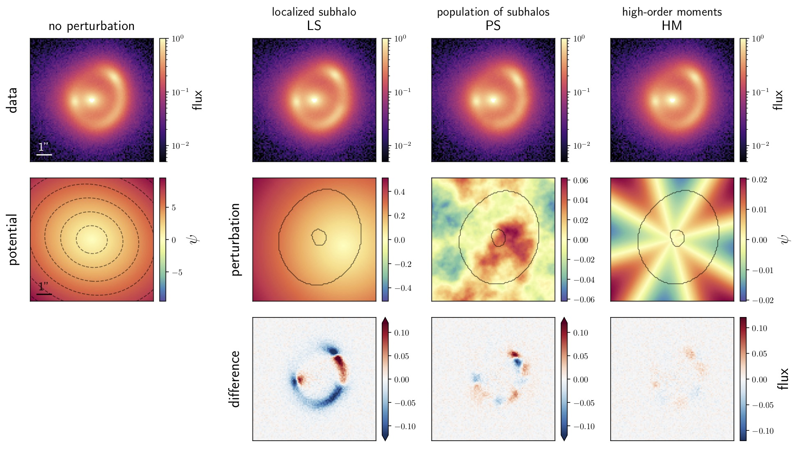
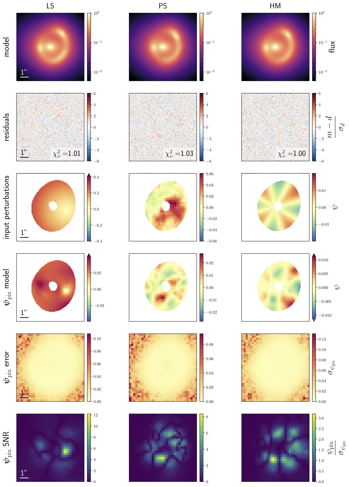
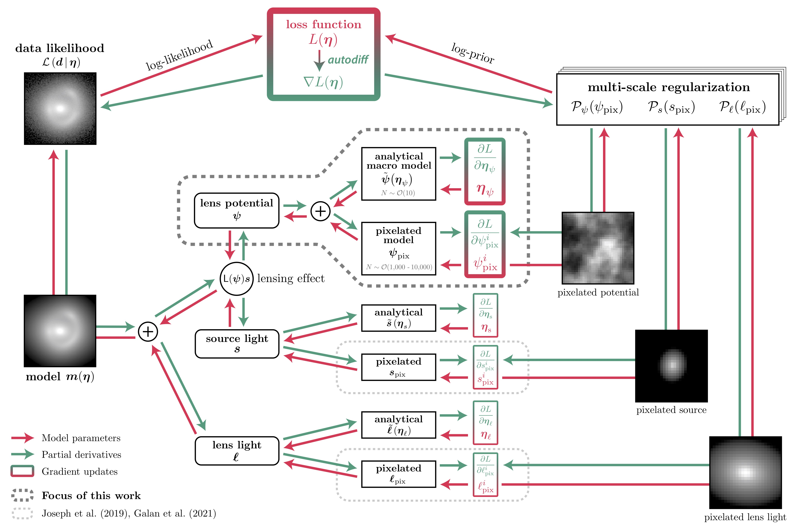

# Flexible lens modeling with Wavelets

This repository gathers notebooks and resources to reproduce the results of [Galan et al. 2021](https://ui.adsabs.harvard.edu/abs/2020arXiv201202802G/abstract) and [Galan et al. 2022](https://ui.adsabs.harvard.edu/abs/2022arXiv220705763G/abstract).

## Paper II

*__Using wavelets to capture deviations from smoothness in galaxy-scale strong lenses__*: [Galan et al. 2022](https://ui.adsabs.harvard.edu/abs/2022arXiv220705763G/abstract) (submitted to A&A)

### Multi-scale model of the lens potential

We introduce a forward pixelated method to reconstruct perturbations to a smooth lens potential on a grid of pixels. The model is regularized using a well-motivated multi-scale approach based on  wavelet transforms and sparsity constraints.

We test and validate the method on three very different types of perturbations:

- **localized dark subhalo** ("LS")
- **population of substructures** along the line of sight ("PS")
- **high-order multipoles** in the lens galaxy ("HM")

<!--  -->

_**Note**: to run the notebooks in the [paper_II](paper_II) directory, it is advised to use the [`paper2`](https://github.com/austinpeel/herculens/tree/paper2) branch from `Herculens`._

### Fully differentiable lens modeling with `Herculens`

This works also releases a new open-source modeling software package. Called [`Herculens`](https://github.com/austinpeel/herculens), its main feature is the _exact_ computation of the gradient and higher-order derivatives of the loss function based on `JAX`. This enables robust convergence to the solution, fast estimation of parameter covariances, and improved sampling in high-dimensional parameter space.

## Paper I

*__SLITronomy: Towards a fully wavelet-based strong lensing inversion technique__*: [Galan et al. 2021](https://ui.adsabs.harvard.edu/abs/2020arXiv201202802G/abstract)

Introduction of an optimised implementation of the SLIT algorithms: [SLITronomy](https://github.com/aymgal/SLITronomy). It is easily accessible through the [lenstronomy](https://github.com/sibirrer/lenstronomy) package. We show applications on both simulated and real HST data, and anticipate the requirements of future E-ELT imaging data.

### Reconstruction of source galaxies from the SLACS sample

Source reconstruction for the system SDSSJ1250+0523, assuming lens model of [Shajib et al. 2020](https://ui.adsabs.harvard.edu/abs/2020arXiv200811724S/abstract).

### Reconstruction of a lensed source galaxies based on future E-ELT data

Source reconstruction for mock E-ELT data, assuming known lens model.

### Support of analytical lens model inference

Joint source reconstruction and lens model posterior inference from mock HST data. The posterior sampling is performed through MCMC capabilities of lenstronomy, and marginalised over choices of the source pixel size.

