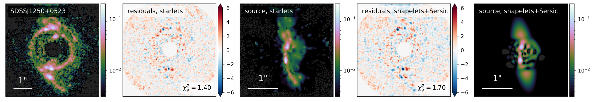
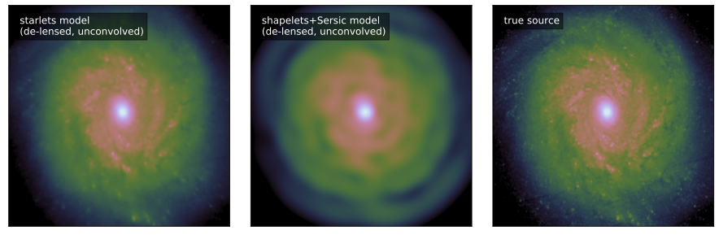
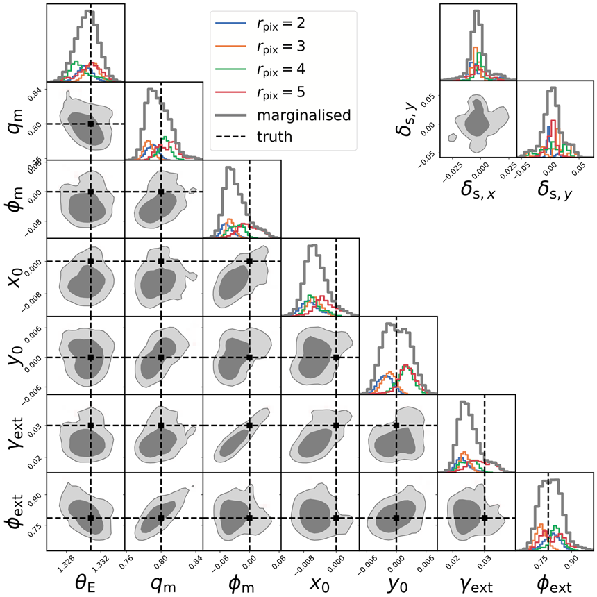

# Complex lens modeling with Wavelets

This repository gathers notebooks and resources used to generate figures of papers related to [SLITronomy](https://github.com/aymgal/SLITronomy) and [Herculens](https://github.com/austinpeel/herculens).

## Paper I

*__SLITronomy: Towards a fully wavelet-based strong lensing inversion technique__*; [Galan et al. 2020](https://ui.adsabs.harvard.edu/abs/2020arXiv201202802G/abstract)

Introduction of an optimised implementation of the SLIT algorithms, easily accessible through the [lenstronomy](https://github.com/sibirrer/lenstronomy) package, application to mock and real HST data, anticipation on future E-ELT image requirements.

### Reconstruction of source galaxies from the SLACS sample

Source reconstruction for the system SDSSJ1250+0523, assuming lens model of [Shajib et al. 2020](https://ui.adsabs.harvard.edu/abs/2020arXiv200811724S/abstract).

### Reconstruction of a lensed source galaxies based on future E-ELT data

Source reconstruction for mock E-ELT data, assuming known lens model.

### Support of analytical lens model inference

Joint source reconstruction and lens model posterior inference from mock HST data. The posterior sampling is performed through MCMC capabilities of lenstronomy, and marginalised over choices of the source pixel size.

